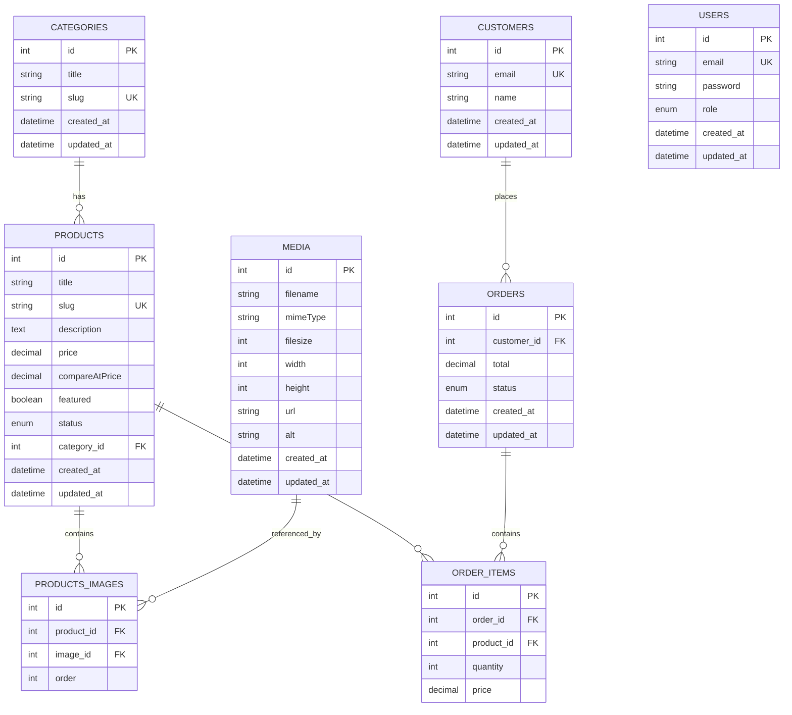

# 📊 DIAGRAMME UML - BASE DE DONNÉES PANTO

## Diagramme Entité-Relation (ERD)

```
┌─────────────────────────────────────────────────────────────────────────────┐
│                          PANTO E-COMMERCE DATABASE                           │
└─────────────────────────────────────────────────────────────────────────────┘

┌──────────────────────┐
│      CATEGORIES      │
├──────────────────────┤
│ PK  id (int)         │
│     title (varchar)  │
│     slug (varchar)   │
│     created_at       │
│     updated_at       │
└──────────────────────┘
         │
         │ 1
         │
         │ has many
         │
         │ *
         ▼
┌──────────────────────┐         ┌──────────────────────┐
│      PRODUCTS        │─────────│  PRODUCTS_IMAGES     │
├──────────────────────┤   1:n   ├──────────────────────┤
│ PK  id (int)         │◄────────│ PK  id (int)         │
│     title (varchar)  │         │ FK  product_id       │
│     slug (varchar)   │         │ FK  image_id         │
│     description      │         │     order (int)      │
│     price (decimal)  │         └──────────────────────┘
│     compareAtPrice   │                  │
│     featured (bool)  │                  │ n:1
│     status (enum)    │                  │
│ FK  category_id      │                  ▼
│     created_at       │         ┌──────────────────────┐
│     updated_at       │         │       MEDIA          │
└──────────────────────┘         ├──────────────────────┤
         │                       │ PK  id (int)         │
         │ n                     │     filename         │
         │                       │     mimeType         │
         │                       │     filesize         │
         │ appears in            │     width (int)      │
         │                       │     height (int)     │
         │ *                     │     url (varchar)    │
         ▼                       │     alt (varchar)    │
┌──────────────────────┐         │     created_at       │
│    ORDER_ITEMS       │         │     updated_at       │
├──────────────────────┤         └──────────────────────┘
│ PK  id (int)         │
│ FK  order_id         │
│ FK  product_id       │
│     quantity (int)   │
│     price (decimal)  │
└──────────────────────┘
         │ *
         │
         │ belongs to
         │
         │ 1
         ▼
┌──────────────────────┐
│       ORDERS         │
├──────────────────────┤
│ PK  id (int)         │
│ FK  customer_id      │
│     total (decimal)  │
│     status (enum)    │
│     created_at       │
│     updated_at       │
└──────────────────────┘
         │ n
         │
         │ placed by
         │
         │ 1
         ▼
┌──────────────────────┐
│      CUSTOMERS       │
├──────────────────────┤
│ PK  id (int)         │
│     email (varchar)  │
│     name (varchar)   │
│     created_at       │
│     updated_at       │
└──────────────────────┘

┌──────────────────────┐
│        USERS         │
│     (Admin Only)     │
├──────────────────────┤
│ PK  id (int)         │
│     email (varchar)  │
│     password (hash)  │
│     role (enum)      │
│     created_at       │
│     updated_at       │
└──────────────────────┘
```

---

## Relations Détaillées

### 1. CATEGORIES → PRODUCTS (1:n)
```
One category HAS MANY products
One product BELONGS TO one category
```
**Clé étrangère** : `products.category_id` → `categories.id`

---

### 2. PRODUCTS → PRODUCTS_IMAGES (1:n)
```
One product HAS MANY images (via junction table)
```
**Table de jonction** : `products_images`
- `product_id` → `products.id`
- `image_id` → `media.id`
- Permet l'ordre des images (`order` field)

---

### 3. MEDIA (Standalone)
```
Centralized media storage
Used by products, potentially by other collections
```
**Utilisé par** : Products (via products_images)

---

### 4. PRODUCTS → ORDER_ITEMS (n:m via junction)
```
One product CAN APPEAR IN many orders
One order CONTAINS many products
```
**Table de jonction** : `order_items`
- Stocke : `quantity`, `price` (snapshot au moment de la commande)

---

### 5. ORDERS → CUSTOMERS (n:1)
```
One customer CAN PLACE many orders
One order BELONGS TO one customer
```
**Clé étrangère** : `orders.customer_id` → `customers.id`

---

### 6. USERS (Isolated)
```
Admin users for Payload CMS
No relation with customers (separate auth systems)
```

---

## Enums & Constraints

### Product Status
```typescript
enum ProductStatus {
  draft = 'draft',
  published = 'published'
}
```

### Order Status
```typescript
enum OrderStatus {
  pending = 'pending',
  processing = 'processing',
  completed = 'completed',
  cancelled = 'cancelled'
}
```

### Constraints
- `categories.slug` → UNIQUE
- `products.slug` → UNIQUE
- `customers.email` → UNIQUE
- `users.email` → UNIQUE
- All foreign keys have ON DELETE CASCADE/SET NULL

---

## Indexes (Performance)

```sql
-- Products
CREATE INDEX idx_products_category ON products(category_id);
CREATE INDEX idx_products_slug ON products(slug);
CREATE INDEX idx_products_status ON products(status);
CREATE INDEX idx_products_featured ON products(featured);

-- Orders
CREATE INDEX idx_orders_customer ON orders(customer_id);
CREATE INDEX idx_orders_status ON orders(status);

-- Order Items
CREATE INDEX idx_order_items_order ON order_items(order_id);
CREATE INDEX idx_order_items_product ON order_items(product_id);

-- Media
CREATE INDEX idx_media_filename ON media(filename);
```

---

## Exemple de Données

### Products
```
id | title              | price | category_id | featured
---|--------------------|-------|-------------|----------
1  | Sakarias Armchair  | 392   | 1 (Chair)   | true
2  | Baltsar Chair      | 299   | 1 (Chair)   | true
3  | Cloudy Sofa        | 899   | 2 (Sofa)    | true
```

### Products_Images
```
id | product_id | image_id | order
---|------------|----------|------
1  | 1          | 5        | 0
2  | 2          | 6        | 0
3  | 3          | 7        | 0
```

### Orders
```
id | customer_id | total   | status
---|-------------|---------|----------
1  | 1           | 691.00  | completed
2  | 2           | 899.00  | pending
```

### Order_Items
```
id | order_id | product_id | quantity | price
---|----------|------------|----------|-------
1  | 1        | 1          | 1        | 392.00
2  | 1        | 2          | 1        | 299.00
3  | 2        | 3          | 1        | 899.00
```

---

## Normalization Level

**3NF (Third Normal Form)**

✅ No repeating groups
✅ All non-key attributes depend on the primary key
✅ No transitive dependencies
✅ Efficient joins via foreign keys

---

## Scalability Considerations

### Current Setup
- PostgreSQL (Neon) → Serverless, auto-scaling
- Indexes on foreign keys → Fast joins
- No N+1 queries (Payload depth loading)

### Future Optimizations
- Add Redis cache for hot products
- Implement read replicas for analytics
- Partition orders table by date
- Add full-text search (PostgreSQL FTS)

---

## Diagramme Mermaid (pour documentation)



---

## Migration SQL (Exemple)

```sql
-- Create Categories
CREATE TABLE categories (
  id SERIAL PRIMARY KEY,
  title VARCHAR(255) NOT NULL,
  slug VARCHAR(255) UNIQUE NOT NULL,
  created_at TIMESTAMP DEFAULT NOW(),
  updated_at TIMESTAMP DEFAULT NOW()
);

-- Create Products
CREATE TABLE products (
  id SERIAL PRIMARY KEY,
  title VARCHAR(255) NOT NULL,
  slug VARCHAR(255) UNIQUE NOT NULL,
  description TEXT,
  price DECIMAL(10,2) NOT NULL,
  compare_at_price DECIMAL(10,2),
  featured BOOLEAN DEFAULT FALSE,
  status VARCHAR(50) DEFAULT 'draft',
  category_id INTEGER REFERENCES categories(id) ON DELETE SET NULL,
  created_at TIMESTAMP DEFAULT NOW(),
  updated_at TIMESTAMP DEFAULT NOW()
);

-- Create Media
CREATE TABLE media (
  id SERIAL PRIMARY KEY,
  filename VARCHAR(255) NOT NULL,
  mime_type VARCHAR(100),
  filesize INTEGER,
  width INTEGER,
  height INTEGER,
  url TEXT NOT NULL,
  alt VARCHAR(255),
  created_at TIMESTAMP DEFAULT NOW(),
  updated_at TIMESTAMP DEFAULT NOW()
);

-- Create Products_Images (Junction)
CREATE TABLE products_images (
  id SERIAL PRIMARY KEY,
  product_id INTEGER REFERENCES products(id) ON DELETE CASCADE,
  image_id INTEGER REFERENCES media(id) ON DELETE CASCADE,
  "order" INTEGER DEFAULT 0
);

-- ... (autres tables)
```

---

Ce diagramme représente la structure actuelle de ta base de données Panto ! 🎯
